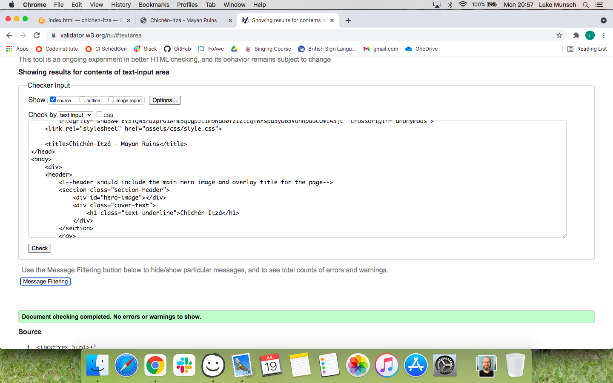
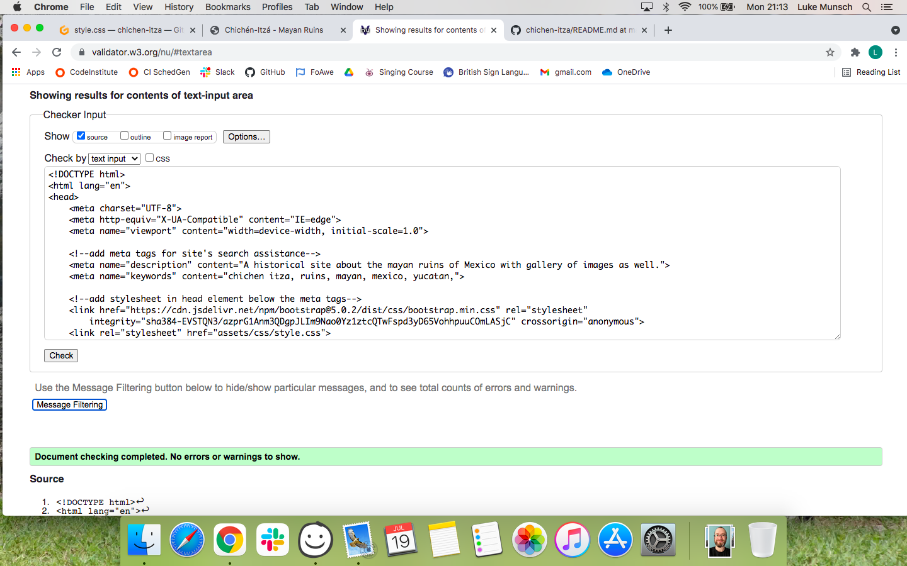
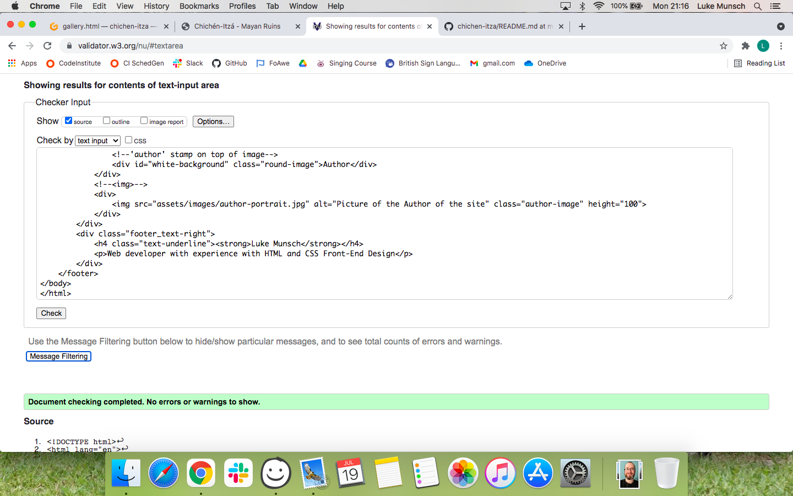
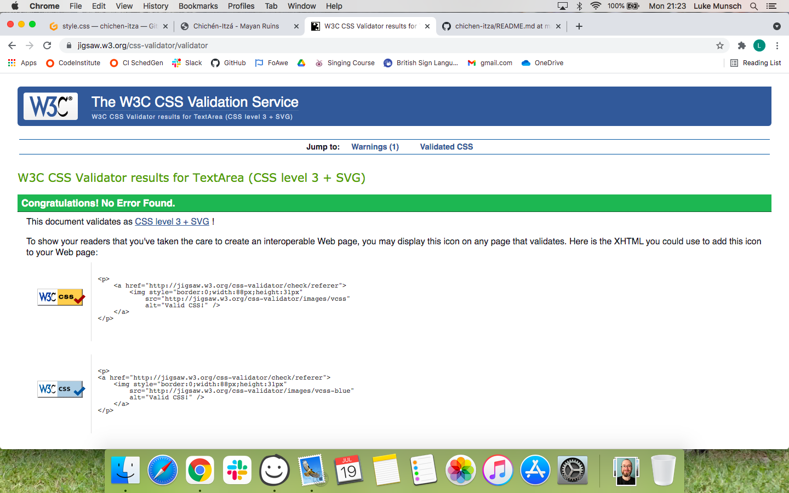

# **Chichén-Itzá - The Mayan ruins of Mexico**

## # Table of contents
1. [Link to live site](#Linktolivesite)
2. [Wireframes](#wireframes)
3. [Overview](#overview)
4. [User Stories](#userstories)
5. [Features](#features)
 1. [Style Choices](#stylechoices)
 2. [Hero Image + Overlay](#heroimage+overlay)
 3. [Nav bar](#navbar)
 4. [Summary](#summary)
 5. [Map + Aside](#map+aside)
 6. [Travel + Tourism](#travel+tourism)
 7. [Footer](#footer)
 8. [Facts and Images](#factsandimages)
 9. [Gallery Page](#gallerypage)
6. [Implementation](#implementation)
7. [Testing](#testing)
 1. [HTML](#html)
 2. [CSS](#css)
8. [Unfixed Bugs](#unfixedbugs)
9. [Deployment](#deployment)
10. [Credits](#credits)

## **Link to live site**

## **Wireframes**

[Index Page Here](https://i.imgur.com/r16x3Y3.png)

[Facts Page Here](https://i.imgur.com/HJCCgOP.png)

[Gallery Page Here](https://i.imgur.com/t9zm8bJ.png)

## Overview

    The Chichén-Itzá site is designed to give users a brief overview about the historic 
    site and information about the relevance to the country in regards to bringing in 
    tourists which affects the economy of Mexico. 
    
    Chichén-Itzá is intended for users who are interested in the historic value of the 
    site by introducing them to facts and images of some of the key features and buildings. 
    Chichén-Itzá site will be useful to users who have interest in either visiting the site 
    to experience it for themselves.

## User Stories

    On a user's first visit, Chichén-Itzá will be a brief overview about the historic 
    site with images related to the site and a few details rearging the ruins. There will
    be accompanying images that hint at the historic value of Chichén-Itzá and the amazing
    vision from menturies ago.

    On a second visit the the site, Chichén-Itzá has more advanced facts and related images 
    that the user may find interesting and help understand more of the ruins and about the 
    poeple of Chichén-Itzá.

    On further visits to the site, the user will see Chichén-Itzá from my viewpoint based on 
    the images I have taken and the exploration of Chichén-Itzá through my perspective.

## Features

### Style Choices

        I have chosen to use a consistant format across the three pages of the site; 
        
        - background colour similar to the blue sky from the pictures taken of Chichén-Itzá, 
        - text and block element colors taken from the stone and building colors from the pictures,
           to keep it easy on the eyes without harsh color contrasts. 
        - the border style of outset creating the appearance of 'tiers' to the element similar to 
        the building style of the site that look like steps up the building.

### Hero Image + Overlay

        The image used at the top of the page is the famous Temple of Kukulkan; the Feathered 
        Serpent of Chichén-Itzá. This is the most famous building at the ruins and synonymous
        with Chichén-Itzá. This led me to use it as the responsive header image for the site 
        on all three pages.

        The overlay text is in a curvey style text in the same color as the body of the site.
        There is text shadow to help separate the writing from the similar color background as 
        the site becomes responsive and the text moves to different contracts against the background.
        The position of the writing as the site responds to viewport width requires the text to change
        size in order to not distort as much as possible.

### Nav bar

        The nav bar is linked to all three pages and is responsive to the size 
        of the viewport. With the order of links from higest relevance to lowest, this 
        set of links is positioned consistently in the same place - below the hero image 
        for the page - so it is easier to navigate the site.

        The nav bar will be responsive and as the viewport changes size the elements within it 
        will change to accomodate the smaller areas.

### Summary

        This is just a brief overview of the site, including the pronunciation of the name and 
        a quick factual statement regarding what Chichén-Itzá is as well as why it is being so 
        popular.

        Centralised text in temple structure style to keep consistant with the style for the Chichén-Itzá 
        site.

### Map + Aside

        This section is a text description of the map positioned aside the text.
        This pairing allows the user to see the location of Chichén-Itzá in relation 
        to other parts of Mexico.

        The map image was picked out from google image search of 'map of Chichén-Itzá'. 
        This is also styled in the 'RAISED-BLOCK' style similar to the rest of the elements.

### Travel + tourism

        * The two sections are layered on top of the background image which is a key construct
          of Chichén-Itzá, the observatory
        * The two text sections blocked off in color are designed to overlap depending on the 
          size of the screen. 
        * They are styled in the outset border to appear tiered.
        * the header is also in the same color scheme and will centralise above the blocks when
          the screen is smaller than 700 pixels.
        
### Footer

        The footer is featured on the bottom of the three pages and will give the users a quick glance
        at the author of the page with an image and text description; name and profession. An image 
        with a stamp icon as well as the textual description and job title for viewers information.

### Facts and images

        This page has a swapping structure with images swapping sides and text opposite ans well 
        as in between the sections, giving them space like a cluster of buildings at the ruins. 
        Like the buildings and their decorations, the page is uniform in their structure.

### Gallery page

        The gallery page is laid out with columns of photos for the viewers to see detailed pictures 
        from around Chichén-Itzá. Columned gallery will also reposnd to sscreen size by reducing the 
        number of columns to help the images retain easy view quality. The images dont always correctly
         aline themselves correctly to the full page nicely, so the footer at the bottom fo the page 
         will give the page a "fixed bottom" instead of tailing off. There are still a few gaps.

## Implementations

        The main index page has the most amount of content as this page is the most visited site; 
        because this page contains most of the elements for the other two pages i have done most 
        of the testing on the index. There are some sections on the other two pages that do not fall 
        in line with the tidy style;

                The Gallery has a columned structure but due to the different image sizes and orientation, 
                they do not form a nice shape, because of this there is some gaps with the background blue
                color. I have considered looking into how to overlap the footer over the bottom of the page 
                without fixing it to the bottom of the page, but that will result in some pictures being 
                cut off or only appearing as a small line with hardly any image.

                The facts page is a cause for concern as the images appearing on the right of the page are 
                unable to push off the right hand side of the page do not leave the right hand edge; even 
                by adding margins and padding the image is fixed on the right and only pushes a margin 
                outside of the page rather than inside the viewport width.

## Testing

        Along with the Chichén-Itzá validator checks below for all our pages, I have also been taking
         full advantage of the inspect and developer tools on chrome browser to help indentify and 
         bereak down any errors and issues i have found. It has been instrumental in helping me arrange 
         and structure the site. Though there are still some errors that i cannot fix, the code i have 
         written has been validated as such, (Results in green line towards bottom of each image)

### HTML

        Index Page Check

        Facts page Check

        Gallery Page Check

        CSS Check

## Unfixed Bugs

## Deployment

## Credits

        The original idea for my framework was taken from a local drum teacher's website, 
        camberleydrumteacher.co.uk, where there was a central container that narrows down the 
        width of the content and adds a margin-esque space to either side; I considered copying 
        this to make a narrower space for my content, but due to complications with images n
        ot performing the way they should and being unable to understand the responsive code 
        and they way certain text flew around the page i scrapped the concept.

        I have used a map that i found on a google search to place in the index.html page to 
        highligh the position of he ruins on the map. https://www.alamy.com/stock-photo-chichen-itza-91709206.html 
        was the location of the photo I have borrowed.

        The text was written out by myself, but i sourced a lot of the information for the site 
        from the wikipedia page for Chichén-Itzá; https://en.wikipedia.org/wiki/Chichen_Itza.

        The main images from Chichén-Itzá were taken on my own camera by myself (except the image 
        of me and my wife which was taken by my brother) during a visit to the ruins in 2013, but 
        are not sourced from any other site or by any other photographer.

        There was one issue i had where a section of my code was ill-performing compared to the
        rest of the site as well as a different element that i was unasure how to make do - 
        namely, the two block divs with travel and tourism. I had some help from the slack pp1 
        group by a user called Matt_Bodden_5p_Lead. He was able to identify a section of my code 
        that was missing a property for the width of the section, even though there was no code 
        telling it that it shouldn't be 100%. He also advised me on the method of adding a 
        separate div container to the inside of the div container including the text for the 
        tourism part. After playing around with the idea i have managed to create a responsive 
        section that can avoid overlapping the travel div over the text in the tourism div.

        There is a stylesheet using bootstrap that i was (mis)informed i should be using. Although 
        there is now no section of code that includes bootstrap responsive code, it does make slight 
        changes when i remove it. Bootstrap was the idea of one of my mentors but i have since 
        learnt that it is not required for Chcién-Itzá.